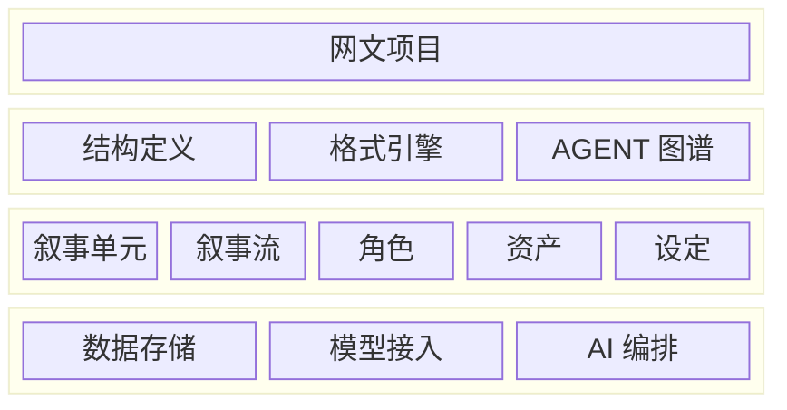

# AI 写作工具设计思路

## Intro

当前范围只有网文一种创作类型，短剧、视觉小说等其他类型暂不考虑——等网文端到端跑通、出现真实需求后再扩展，不提前为未实现的模式做抽象。

架构上做四层划分，目的是把模式相关的内容（结构定义、格式引擎、Agent 工作流）与模式无关的内容（元数据、基础设施）分离，未来增加新模式时只需在模式层增加实现，不动下面两层。



## FRONTEND: 前端框架

网文写作工作区，暂时使用简单的写作软件方案。

## MODE: 模式层

### Structure Definition: 结构定义

定义叙事单元的类型、层级、约束规则。

网文：Volume / Chapter / Section

### Format Engine: 格式引擎

不同的项目可能需要支持不同格式的内容，因此需要使用格式引擎来对内容进行序列转化

但前期使用 Markdown 和 Markdown 的拓展方案即可，不需要太折腾

### Agent Graph: Agent 图谱

网文的工作流跑在共享的底层能力（LLM 调用、RAG 检索、记忆管理）之上。

核心链：灵感 → 方向 → 世界观 → 角色 → 卷纲 → 章纲 → 生成 → 审核 → 修复 → 水文控制

章节执行守卫（生成节点的确定性检查，不依赖模型自觉）：

- 开头多样性：与近 N 章开头比对相似度，超限触发重写（AI 味的主要来源是章章开头雷同）
- 续写相似度：续写内容与既有正文过度相似时重写
- 字数区间：目标字数带最小/最大区间，不足则带尾部摘要续写补齐，不重开

## METADATA: 元数据层

### Asset: 资产

资产分两级：

| 级别 | 位置 | 定位 |
| ---- | ---- | ---- |
| 项目资产 | 项目文件夹（`设定/` 等） | 本项目写作时的唯一权威，随文件夹迁移/同步/进版本管理 |
| 全局资产 | `~/.config/shiro/db/`（人物库等内容库） | 跨项目复用的素材库，沉淀好用的角色类型、设定模板 |

**引用语义：实例化，不做活链接。**

- 「应用到项目」：从全局库复制一份到项目内成为项目资产，可自由改写，记录来源标注便于追溯
- 「发布到全局库」：把项目内打磨好的角色/设定存为全局模板
- 全局资产后续修改不自动影响已应用的项目：项目自包含（拷走文件夹不残缺），已写内容的依据不漂移；需要更新时在项目内显式「从来源更新」
- 生成上下文中的**权威事实**（本作的角色设定、剧情、时间线）必须来自项目内资产；全局库资料可作为**写作参考**（同类角色原型、套路写法）进入生成上下文，但须标注为参考素材而非本作事实

资产形态：

```text
资产（Asset）
├── 文本资产
│   ├── 角色卡（Character Card）
│   └── 世界观设定（World Bible）
├── 多媒体资产
│   └── 图片（概念图、封面素材）
└── 结构化资产
    ├── 时间线（Timeline）— 防止穿帮
    ├── 关系图（Relationship Graph）— 人物关系网
    ├── 情绪曲线（Emotion Curve）— 节拍表
    ├── 信息披露状态（Information State）— 谁知道什么，防穿帮的核心抓手：第 57 章她已知秘密 X，后续章节不能当作她不知道
    └── 伏笔台账（Payoff Ledger）— 埋设 / 回收 / 进度，长篇一致性的刚需
```

## INFRA: 基础设施层

### Store: 数据存储

数据存储采用 markdown 文本进行存储，方便索引和查看

### AI 接入

模型接入走 daemon 内的 provider 抽象（见[模型接入设计](./backend/model-access.md)）。

**按任务类型路由**：规划、正文、审核等环节可各自绑定模型档位（未配置时用默认档案），允许「强模型跑规划、性价比模型跑审核」。

### AI 编排

在 daemon（Rust）内实现一套类 LangGraph 的轻量管道引擎。编排逻辑全部留在后端，前端只做展示与确认，不承载工作流逻辑——桌面版、局域网浏览器、未来服务器版共用同一套编排。

**核心概念**（LangGraph 的最小子集）：

- **Node（节点）**：执行单元 = 上下文组装 + 提示词模板 + 模型调用 + 结构化输出解析 + 产物写入。节点种类由代码实现（生成 / 审核 / 修复 / 变换），数量有限，不做插件系统。生成 / 审核类节点运行在有界工具循环中（见下）
- **Edge（边）**：节点间转移，可带条件（审核不通过 → 修复 → 回到审核），条件是节点输出上的简单判定
- **State（状态）**：工作流实例的当前节点、各节点产物引用与变量。每完成一个节点即落盘检查点到项目 `.shiro/`，重启后恢复现场
- **Runner（执行器）**：遍历图执行节点。以用户逐步推进为主（人工把关），局部允许有界自主循环（生成 → 审核 → 修复，限制迭代次数）

**工作流定义是数据不是代码**：网文工作流以 TOML/JSON 定义（步骤、模板引用、边与条件），初期由 daemon 内置，节点种类由 Rust 实现。

**节点内的信息获取：push + pull 混合。** 控制流归产品（下一步是什么），信息获取允许模型参与（这一步还缺什么素材）：

- **必带上下文（push）**：节点定义声明必需输入（章纲、出场角色卡、前情摘要等），由 Runner 确定性组装——关键事实不依赖模型自觉，杜绝「没查资料就开写」
- **push 的量级控制：最小充分集，不是「相关的全塞」**。只组装本步骤必需的：出场角色的卡而非全角色库、相关设定条目而非整本 world bible、近况 + 相关卷摘要而非全部历史。支撑机制：
  - 上下文块预算制：push 内容切分为带优先级的块（章纲、出场角色卡、前情摘要、写法约束…），按优先级装入 token 预算，超限时低优先级块降级为截断摘要或丢弃，保留压缩日志——「带什么」不靠拍脑袋，靠优先级规则
  - 节点是独立调用，不共享对话历史：状态存产物引用，每次重新组装，节点结束即丢弃，push 不跨节点累积
  - 摘要链是资产：每章确认后产出章摘要（生成节点副产物），逐级归并为卷摘要 / 全书梗概，push 前情的成本是 O(相关) 而非 O(全书)
  - 角色卡分层：静态核心（人设、动机、关系）进卡保持短小，动态履历指向时间线，按需查询
  - pull 结果截断：检索返回命中片段而非全文，模型看片段决定是否读原文（两段式检索）
- **领域工具（pull）**：模型在节点内可调用只读工具按需补充——查资产（角色卡 / 设定 / 时间线 / 关系图）、检索项目全文、读章节原文、查全局库参考。给领域工具而非通用文件工具：参数化、只读、可审计，每次调用可在界面还原为「本次生成参考了什么」
- **边界**：工具一律只读，产物仍走草稿→确认；每节点工具调用轮数有上限（成本控制）；调用记录随检查点落盘
- **检索基础设施**：单项目文本量级小（MB 级），第一版为关键词匹配，毫秒级；语义检索（向量索引）待真实瓶颈出现再加

**状态回灌：提案分级。** 章节确认后，从正文提取状态变更提案写入元数据层，按风险分级提交：

- 自动入库：时间线事件、角色状态更新、伏笔推进
- 人工评审：关系变更、信息披露、世界观/设定变更

披露与设定类变更影响后续所有章节的事实基准，必须过人工评审；回灌带版本记录，可追溯「这条状态是哪章改的」。

**明确不做**：动态拓扑、子图、并行分支、无界 agent 自主循环、插件系统。

**不引入外部编排框架 / agent harness**（LangGraph、pi 类工具）：工作流是产品驱动的固定管道（控制流在产品手里，不在模型手里），且外部框架意味着第二运行时、双份配置与密钥、外来会话格式，与单二进制 daemon 和 `.shiro/` 状态设计冲突。节点内的有界工具循环与未来的对话式 copilot 共用同一套领域工具基础设施（查角色卡、读时间线、检索全文等），daemon 内自研实现。成熟 harness 的设计可借鉴：流式事件分类、有界重试、上下文压缩（对应前情摘要链）、会话分叉（对应检查点回退重跑）。

**与现有设计的衔接**：

- 模型调用走 provider 抽象（见[模型接入设计](./backend/model-access.md)），节点执行事件（状态变化 + token 流）经 SSE 转发前端
- 提示词模板由 daemon 管理，节点定义引用模板
- 产物即项目文件：确认后写入正文/大纲，待确认的先进草稿
